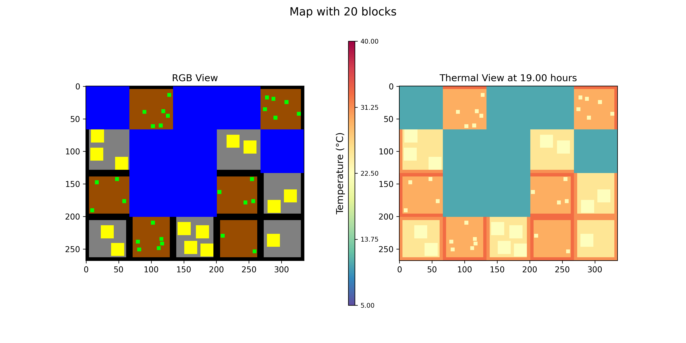
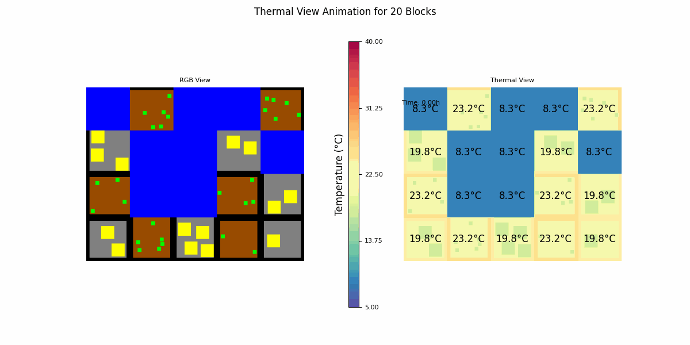

# 🌳 Canopy Simulation 🌞

## Overview

**Canopy Simulation** is a Python project designed to simulate and visualize the thermal behavior of different environmental elements (blocks, houses, trees, roads) within a customizable grid. It provides a flexible setup for generating thermal maps, simulating temperature variations across time, and visualizing them in both RGB and thermal views.

Whether you're analyzing urban heat islands or experimenting with environmental layouts, this simulation provides a comprehensive view of thermal dynamics within your virtual canopy.

## Features

- 🏡 **Thermal Item Simulation**: Generates blocks, houses, trees, and other elements, each with unique thermal properties.
- 🌡️ **Thermal Map Visualization**: Visualize temperature variations with clear thermal and RGB representations.
- 🕒 **Time-Based Simulations**: View thermal maps at specific times of day (0-24).
- 🛠️ **Highly Customizable**: Modify the configuration through user input to adjust the number of blocks, houses, and trees.
- 🎨 **Visual Outputs**: Generate easy-to-interpret thermal and RGB visual outputs with `matplotlib`.

## 🗂️ Project Structure

```
Canopy_Simulation/
│
├── extract.py               # Functions for data extraction and manipulation
├── input.txt                # Config file for user-defined simulation parameters
├── main.py                  # Main script to run the simulation
├── requirement.txt          # Dependencies for the project
├── utils.py                 # Utility functions for block generation and thermal updates
└── visualization.py         # Handles visual outputs (RGB and thermal maps)
```

## 📦 Requirements

This project requires the following Python packages:

```bash
matplotlib==3.9.0
tabulate==0.9.0
colorama==0.4.6
numpy==2.0.0
```

Install all required dependencies via:

```bash
pip install -r requirement.txt
```

## ⚙️ Configuration

You can modify the simulation settings by editing the `input.txt` file. Here’s an example configuration:

```
Num Blocks: 20
Num Rows: 4
Num Block Yards: 6
Num Block Ground: 6
Num Block River: 8
Num houses of each Block Yard: 14
Num trees of each Block Ground: 28
The time (0-24) to view Thermal Map: 19
```

- **Num Blocks**: Total number of blocks.
- **Num Rows**: Number of rows in the block grid.
- **Num Block Yards**: Number of yard blocks.
- **Num Block Ground**: Number of ground blocks.
- **Num Block River**: Number of river blocks.
- **Num houses of each Block Yard**: Houses generated per yard block.
- **Num trees of each Block Ground**: Trees generated per ground block.
- **Time to view Thermal Map**: Hour of the day to display the thermal map.

## 🚀 Running the Simulation

To start the simulation, simply run:

```bash
python main.py
```

The simulation will generate a thermal map at the specified time in the configuration, visualizing temperature distribution across the landscape.

## 📊 Example Output

Once the simulation completes, you will see both an RGB and thermal visualization of the blocks. These visualizations provide insights into the thermal dynamics across different regions of your simulation.

- Time: 19.00h
  

- Simulation:
  

## 🌟 Key Scripts

- **`main.py`**: The primary script for managing the simulation, taking user inputs, and generating visual outputs.
- **`extract.py`**: Handles data extraction and processes the inputs for the simulation.
- **`utils.py`**: Contains helper functions for generating and managing block layouts and updating thermal properties.
- **`visualization.py`**: Responsible for rendering the visual outputs, including thermal and RGB maps.
